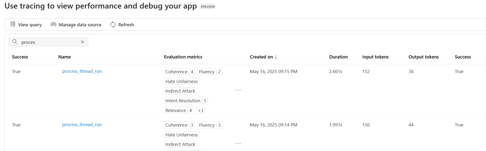

# Other Features

## Tracing and Monitoring

**First, if tracing isn't enabled yet, enable tracing by setting the environment variable:**

```shell
azd env set ENABLE_AZURE_MONITOR_TRACING true
azd deploy
```

You can view console logs in the Azure portal. You can get the link to the resource group with the azd tool:

```shell
azd show
```

Or if you want to navigate from the Azure portal main page, select your resource group from the 'Recent' list, or by clicking the 'Resource groups' and searching your resource group there.

After accessing your resource group in Azure portal, choose your container app from the list of resources. Then open 'Monitoring' and 'Log Stream'. Choose the 'Application' radio button to view application logs. You can choose between real-time and historical using the corresponding radio buttons. Note that it may take some time for the historical view to be updated with the latest logs.

You can view the App Insights tracing in Azure AI Foundry. Select your project on the Azure AI Foundry page and then click 'Tracing'. 


## Continuous Evaluation

Continuous evaluation is an automated monitoring capability that continuously assesses your agent's quality, performance, and safety as it handles real user interactions in production. It helps you catch potential issues early by running evaluators on actual conversations, ensuring your agent maintains high standards over time.

During container startup, continuous evaluation is already set up but disabled by default. Continuous evaluation allows you to automatically monitor and assess your agent's performance over time as it handles real user interactions.

To enable continuous evaluation:

1. Go to [Azure AI Foundry Portal](https://ai.azure.com/) and sign in
2. Click on your project from the homepage
3. In the top navigation, select **Build on top**
4. In the left-hand menu, select **Agents**
5. Select **Monitor**
6. Choose the agent you want to enable continuous evaluation for from the agent list
7. Click on **Settings**
8. Toggle the **Enabled** switch for continuous evaluation


Once enabled, your agent will be continuously evaluated based on the configured criteria, allowing you to track performance metrics and identify potential issues in production.

## Agent Evaluation

**First, make sure tracing is working by following the steps in the [Tracing and Monitoring](#tracing-and-monitoring) section above.**

Microsoft Foundry offers a number of [built-in evaluators](https://learn.microsoft.com/azure/ai-foundry/how-to/develop/agent-evaluate-sdk) to measure the quality, efficiency, risk and safety of your agents. For example, intent resolution, tool call accuracy, and task adherence evaluators are targeted to assess the performance of agent workflow, while content safety evaluator checks for inappropriate content in the responses such as violence or hate.

In this template, we show how these evaluations can be performed during different phases of your development cycle.

- **Local development**: You can use the [evaluation test script](../tests/test_evaluation.py) to validate your agent's performance using built-in Azure AI evaluators. The test demonstrates how to:
  - Create an evaluation with custom data source configuration
  - Define testing criteria using Azure AI evaluators (e.g., violence detection)
  - Run evaluation against specific test queries
  - Retrieve and analyze evaluation results

  The test reads the following environment variables:
  - `AZURE_EXISTING_AIPROJECT_ENDPOINT`: AI Project endpoint
  - `AZURE_EXISTING_AGENT_ID`: AI Agent Id in the format `agent_name:agent_version` (with fallback logic to look up the latest version by name using `AZURE_AI_AGENT_NAME`)

  **Note:** Most of these environment variables are generated locally in `.env` after executing `azd up`. To find the Agent ID remotely in the Azure AI Foundry Portal:

  1. Go to [Azure AI Foundry Portal](https://ai.azure.com/) and sign in
  2. Click on your project from the homepage
  3. In the left-hand menu, select **Agents**
  4. Choose the agent you want to inspect
  5. The Agent ID will be shown in the agent's detail panel—usually near the top or under the "Properties" or "Overview" tab
  
  

  To install required packages and run the evaluation test:  

  ```shell
  python -m pip install -r src/requirements.txt

  pytest tests/test_evaluation.py
  ```

  **Tip:** Add the `-s` flag to see detailed print output during test execution:
  ```shell
  pytest tests/test_evaluation.py -s
  ```

- **Monitoring**: You can view evaluation results and traces from the AI Foundry Tracing tab.
    
    Alternatively, you can go to your Application Insights logs for an interactive experience. To access Application Insights logs in the Azure portal:
    
    1. Navigate to your resource group (use `azd show` to get the link)
    2. Find and click on the Application Insights resource (usually named starts with `appi-`)
    3. In the left menu, click on **Logs** under the **Monitoring** section
    4. You can now run KQL queries in the query editor
    
    Here is an example query to see logs on thread runs and related events:

    ```kql
    let thread_run_events = traces
    | extend thread_run_id = tostring(customDimensions.["gen_ai.thread.run.id"]);
    dependencies 
    | extend thread_run_id = tostring(customDimensions.["gen_ai.thread.run.id"])
    | join kind=leftouter thread_run_events on thread_run_id
    | where isnotempty(thread_run_id)
    | project timestamp, thread_run_id, name, success, duration, event_message = message, event_dimensions=customDimensions1
   ```


## AI Red Teaming Agent

The [AI Red Teaming Agent](https://learn.microsoft.com/azure/ai-foundry/concepts/ai-red-teaming-agent) is a powerful tool designed to help organizations proactively find security and safety risks associated with generative AI systems during design and development of generative AI models and applications.

In the [red teaming test script](../tests/test_red_teaming.py), you will be able to set up an AI Red Teaming Agent to run an automated scan of your agent in this sample. The test demonstrates how to:
- Create evaluation groups and runs for red teaming
- Generate taxonomies for risk categories (e.g., prohibited actions)
- Configure attack strategies (Flip, Base64) with multi-turn conversations
- Use built-in safety evaluators (prohibited actions, task adherence, sensitive data leakage, self-harm, violence, sexual, hate/unfairness)
- Retrieve and analyze red teaming results

No test dataset or adversarial LLM is needed as the AI Red Teaming Agent will generate all the attack prompts for you.

To install required packages and run the red teaming test in your local development environment:  

```shell
python -m pip install -r src/requirements.txt

pytest tests/test_red_teaming.py
```

**Tip:** Add the `-s` flag to see detailed print output during test execution:
```shell
pytest tests/test_red_teaming.py -s
```

The test will generate output files in the `tests/data_folder` directory:
- `taxonomy_{agent_name}.json`: The generated taxonomy for red teaming
- `redteam_eval_output_items_{agent_name}.json`: Detailed results from the red teaming evaluation

Read more on supported attack techniques and risk categories in our [documentation](https://learn.microsoft.com/azure/ai-foundry/how-to/develop/run-scans-ai-red-teaming-agent).
